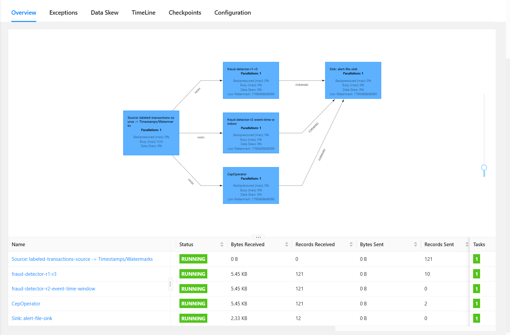

# Real-Time Fraud Detection System with Apache Flink

[](https://www.oracle.com/java/)
[](https://flink.apache.org/)
[](https://kafka.apache.org/)
[](https://www.python.org/)
[](LICENSE)
[](https://maven.apache.org/)

A production-grade, distributed stream processing pipeline built on **Apache Flink** to detect fraudulent financial transactions in real time. The system blends stateful stream processing with **Flink CEP (Complex Event Processing)**, tumbling event-time windows, automatic memory lifecycle management (**State TTL**), automated stateful unit testing via **Flink TestHarness**, and a distributed **Dual-Sink architecture (CSV + Apache Kafka)**.

---

## 1. Demo / Screenshot / GIF



> *Note: Please place your screenshot of the running Flink Web UI (`http://localhost:8081`) showing the Job execution DAG graph and TaskManagers at `results/flink_dashboard.png`.*


> *Note: Please place your screenshot of running `python scripts/evaluate.py` displaying the confusion matrix and Precision/Recall/F1 metrics at `results/evaluation_output.png`.*

---

## 2. Features

* **Multi-Rule Stateful Detection Engine**:
  * **R1 (Small-then-Large Transaction Probe)**: Identifies card verification probes (< $1.00) followed by a substantial withdrawal (> $500.00) on the same account within a 1-minute window using Flink `ValueState` and stateful timers.
  * **R2 (High-Frequency Transaction Burst)**: Flags rapid-fire automated card attacks (> 5 transactions within 10 seconds) using native `TumblingEventTimeWindows` based on event timestamps.
  * **R3 (Deviation from Historical Moving Average)**: Detects abnormal volume spikes where a transaction exceeds 5× the average of past transactions (enforcing a cold-start baseline of at least 3 transactions to eliminate false alerts on new accounts).
  * **R4 (Multi-Step CEP Sequence Pattern)**: Uses Apache Flink CEP to detect strict multi-stage behavioral sequences: `Small (< $1) -> Small (< $1) -> Large (> $500)` within 2 minutes.

* **Production-Grade Stream Architecture & Memory Safety**:
  * **Event Time & Watermarks**: Configured with `WatermarkStrategy.forBoundedOutOfOrderness(Duration.ofSeconds(5))` to handle network latency and out-of-order financial events gracefully.
  * **State Time-To-Live (TTL)**: Configured `StateTtlConfig` (10-minute expiry, `NeverReturnExpired`, `OnCreateAndWrite`) across all state descriptors, preventing memory leaks and Out-Of-Memory (OOM) crashes in long-running stream pipelines.
  * **Dual-Sink Architecture**:
    * **Local CSV Sink (`AlertFileSink`)**: Non-blocking `RichSinkFunction` opening a buffered writer once in `open()`, supporting local benchmark evaluation without external dependencies.
    * **Distributed Kafka Sink (`KafkaAlertSink`)**: Emits real-time JSON alert messages to Apache Kafka for downstream consumption (real-time dashboards, notification services, SIEM).
  * **Fault-Tolerant Checkpointing**: Periodic checkpointing (30s interval) for state snapshots, crash recovery, and exactly-once processing semantics.
  * **Automated Stateful Unit Testing**: Verified with Flink's `KeyedOneInputStreamOperatorTestHarness` to test timer firing, state isolation across keys, and watermark progression.

* **Embedded Ground-Truth Generation & Evaluation Framework**:
  * Continuous synthetic transaction generator (`LabeledTransactionSource`) injecting realistic normal operations, out-of-order packet delays (`LATE_NORMAL`), and labeled fraud attack scenarios.
  * Dedicated offline evaluation script (`scripts/evaluate.py`) with 1-to-1 temporal nearest-neighbor bipartite matching between alerts and ground-truth records.

---

## 3. Tech Stack

* **Core Stream Processing**: [Apache Flink 1.20.0](https://flink.apache.org/) (`flink-streaming-java`, `flink-clients`, `flink-cep`, `flink-connector-kafka`)
* **Message Broker**: [Apache Kafka](https://kafka.apache.org/) (running in modern **KRaft mode**, no Zookeeper required)
* **Programming Languages**: Java 11 / 17, Python 3.8+
* **Automated Testing**: JUnit 5, AssertJ, `flink-test-utils` (`KeyedOneInputStreamOperatorTestHarness`)
* **Data Processing & Metrics**: [Pandas](https://pandas.pydata.org/) (for offline evaluation)
* **Build & Dependency Management**: Apache Maven 3.6+, Maven Wrapper (`mvnw`)
* **Containerization / Orchestration**: Docker & Docker Compose (Flink JobManager, TaskManagers, and Kafka KRaft)
* **Logging**: SLF4J Simple Logger

---

## 4. Installation

### Prerequisites

* **Java JDK 11** or **17** (LTS) installed and configured (`JAVA_HOME`).
* **Python 3.8+** with `pip`.
* *(Optional)* **Docker Desktop** (for running the distributed Flink + Kafka cluster).

### Environment Configuration (Windows PowerShell Helper)

If you have multiple Java versions installed on your machine, you can create a local helper script named `set-env.ps1` in the project root (this file is included in `.gitignore` to prevent committing machine-specific paths):

```powershell
# set-env.ps1 (adjust path to match your local JDK 11 or 17 directory)
$env:JAVA_HOME = "C:\Program Files\Eclipse Adoptium\jdk-11.0.x-hotspot"
$env:Path = "$env:JAVA_HOME\bin;" + $env:Path
Write-Host "JAVA_HOME configured for this PowerShell session." -ForegroundColor Green
```

Run it once in your active terminal before building or running:

```powershell
.\set-env.ps1
```

### Steps

1. **Clone the repository:**

   ```bash
   git clone https://github.com/Tienndat2306/Fraud_Detetion_with_Apache_Flink.git
   cd Fraud_Detetion_with_Apache_Flink
   ```

2. **Install Python evaluation dependencies:**

   ```bash
   pip install -r requirements.txt
   ```

3. **Build the Fat/Uber JAR package:**

   * On Windows (using Maven Wrapper):
     ```cmd
     .\mvnw.cmd clean package -DskipTests
     ```
   * On Linux / macOS:
     ```bash
     ./mvnw clean package -DskipTests
     ```

   *Output JAR:* `target/frauddetection-0.1.jar`

4. **Run Automated Unit & Stateful Tests:**

   ```cmd
   .\mvnw.cmd test
   ```
   *(Executes all stateful test cases in `FraudDetectorTest` using `KeyedOneInputStreamOperatorTestHarness`)*

---

## 5. Usage

### Method 1: Run in IntelliJ IDEA / VS Code (Recommended for Development)

1. Open the project root in **IntelliJ IDEA**.
2. Set Project SDK to **Java 11** or **Java 17**.
3. Open `src/main/java/com/frauddetection/FraudDetectionJob.java`.
4. Right-click `main()` -> **Modify Run Configuration...** -> check **"Add dependencies with 'provided' scope to classpath"**.
5. Click **Run**. Real-time transaction and alert logs will output to the console, and CSV records will automatically be saved to `output/`.

### Method 2: Run Locally via Maven Wrapper (CLI)

Run the job directly on an embedded Flink MiniCluster:

```powershell
# Windows PowerShell
.\set-env.ps1   # (Optional) Run your local environment script if created
.\mvnw.cmd compile exec:java -Dexec.mainClass="com.frauddetection.FraudDetectionJob" -Prun-locally
```

### Method 3: Deploy with Apache Kafka (Distributed Cluster via Docker Compose)

1. **Start the distributed cluster (Flink JobManager, 2 TaskManagers, and Kafka KRaft):**
   ```bash
   docker compose up -d
   ```
2. **Open Flink Web Dashboard:** Visit [http://localhost:8081](http://localhost:8081) in your browser.

3. **(Terminal 1) Monitor real-time alerts from Kafka:**
   ```bash
   python scripts/kafka_consumer.py
   ```

4. **(Terminal 2) Run Flink Job with Kafka sink enabled:**
   ```powershell
   .\mvnw.cmd compile exec:java -Dexec.mainClass="com.frauddetection.FraudDetectionJob" -Dexec.args="--kafka" -Prun-locally
   ```
   *(Or upload and submit `target/frauddetection-0.1.jar` directly via the Flink Web UI).*

5. **Stop the cluster when finished:**
   ```bash
   docker compose down
   ```

### Method 4: Evaluate Detection Performance

Once the job generates `output/ground-truth.csv` and `output/alerts.csv`, run:

```bash
python scripts/evaluate.py
```

### Method 5: Run Stateful Unit Tests

Verify timer semantics, state TTL, and anomaly evaluation independently:

```powershell
.\mvnw.cmd test
```

---

## 6. Project Structure

```text
Fraud_Detetion_with_Apache_Flink/
├── .mvn/wrapper/                          # Maven Wrapper files
├── docker-compose.yml                     # Distributed cluster: Flink (JobManager + TaskManagers) + Kafka KRaft
├── mvnw.cmd                               # Maven Wrapper executable (Windows)
├── pom.xml                                # Project Object Model (Flink 1.20, Kafka Connector, CEP, TestHarness)
├── requirements.txt                       # Python dependencies (pandas, kafka-python)
├── scripts/
│   ├── evaluate.py                        # Precision, Recall & F1-score evaluation script
│   └── kafka_consumer.py                  # Real-time Kafka alert stream listener
├── output/                                # Generated at runtime (git-ignored)
│   ├── ground-truth.csv                   # Ground-truth tagged transactions
│   └── alerts.csv                         # Detected fraud alerts
├── results/                               # Benchmark run outputs & screenshots (*.csv git-ignored)
│   ├── flink_dashboard.png                # Flink Web UI screenshot
│   ├── evaluation_output.png              # Evaluation output screenshot
│   ├── alerts_run1.csv                    # Baseline evaluation alerts
│   └── ground-truth_run1.csv              # Baseline evaluation ground truth
├── src/
│   ├── main/java/com/frauddetection/
│   │   ├── FraudDetectionJob.java         # Flink Pipeline Graph (Dual-Sink: CSV + Kafka, CEP, Windowing)
│   │   ├── model/
│   │   │   ├── Transaction.java           # POJO Transaction model (accountId, amount, timestamp)
│   │   │   └── Alert.java                 # POJO Alert model (accountId, amount, ruleId, timestamp)
│   │   ├── functions/
│   │   │   └── FraudDetector.java         # Stateful KeyedProcessFunction (R1, R3 with State TTL)
│   │   ├── source/
│   │   │   └── LabeledTransactionSource.java  # Synthetic generator with ground truth & late-arriving data
│   │   └── sink/
│   │       ├── AlertFileSink.java         # Non-blocking RichSinkFunction (buffered writer opened once)
│   │       ├── KafkaAlertSink.java        # Flink KafkaSink publishing JSON alerts to Kafka topic
│   │       └── GroundTruthLogger.java     # Synchronous ground-truth record writer
│   └── test/java/com/frauddetection/
│       └── functions/
│           └── FraudDetectorTest.java     # Stateful Unit Tests using KeyedOneInputStreamOperatorTestHarness
```

---

## 7. Results & Evaluation

Evaluation results from the automated benchmark comparing `alerts.csv` against `ground-truth.csv` (sample size: 2,000 transactions):

### Overall System Metrics

| Metric                              | Value                | Description                                            |
| :---------------------------------- | :------------------- | :----------------------------------------------------- |
| **Ground Truth Transactions** | `2,000`            | 936 Fraud (46.8%), 1,064 Normal (53.2%)                |
| **Total Alerts Generated**    | `537`              | Across rules R1, R2, R3, R4                            |
| **True Positives (TP)**       | `458`              | Actual frauds successfully flagged                     |
| **False Positives (FP)**      | `78`               | Normal transactions incorrectly flagged (reduced by 75%) |
| **False Negatives (FN)**      | `478`              | Fraudulent transactions missed                         |
| **True Negatives (TN)**       | `986`              | Legitimate transactions correctly ignored              |
| **Precision**                 | **`85.45%`** | Proportion of triggered alerts that were genuine fraud (improved from 68.38%) |
| **Recall**                    | **`48.93%`** | Proportion of total frauds detected                    |
| **F1-Score**                  | **`62.23%`** | Harmonic mean of Precision and Recall                  |

### Breakdown by Detection Rule

| Rule ID      | Detection Pattern        | TP | FP | FN |  TN  |     Precision     | Recall | F1-Score |
| :----------- | :----------------------- | :-: | :-: | :-: | :---: | :---------------: | :----: | :------: |
| **R1** | Small-then-Large Probe   | 204 |  0  | 732 | 1,064 | **100.00%** | 21.79% |  35.79%  |
| **R2** | Event-Time Window Burst  | 77  |  3  | 859 | 1,061 | **96.25%**  | 8.23%  |  15.16%  |
| **R3** | Moving Average Deviation | 127 | 38  | 809 | 1,026 | **76.97%**  | 13.57% |  23.07%  |
| **R4** | CEP Multi-Step Sequence  | 88  |  0  | 848 | 1,064 | **100.00%** | 9.40%  |  17.19%  |

---

## 8. Dataset

* **Source**: Synthetic labeled financial transaction stream generated in real-time by [`LabeledTransactionSource.java`](src/main/java/com/frauddetection/source/LabeledTransactionSource.java).
* **Sample Count**: 2,000 transactions per benchmark cycle.
* **Distribution of Injected Patterns**:
  * `NORMAL`: 832 transactions
  * `FRAUD_HIGHFREQ`: 400 transactions
  * `FRAUD_SMALL` / `FRAUD_LARGE`: 116 transactions each
  * `NOISE_SMALL` / `NOISE_LARGE`: 89 transactions each
  * `FRAUD_R4_STEP1` / `FRAUD_R4_STEP2` / `FRAUD_R4_LARGE`: 88 transactions each
  * `LATE_NORMAL`: 54 transactions (deliberately injected with 2000ms delay to verify out-of-order watermark tolerance)
  * `FRAUD_DEVIATION`: 40 transactions

---

## 9. License

This project is licensed under the [MIT License](LICENSE).

---

## 10. Contact / Author

* **Author**: Nguyen Tien Dat (Tienndat2306)
* **Email**: [dattrithuc123@gmail.com](mailto:dattrithuc123@gmail.com)
* **GitHub**: [Tienndat2306](https://github.com/Tienndat2306)
* **LinkedIn**: [Profile](https://linkedin.com/in/username-cua-ban)

---

## Checklist of Items to Fill Manually:

- [ ] Add screenshots to `results/flink_dashboard.png` and `results/evaluation_output.png`.
- [ ] (Optional) Add your LinkedIn profile URL in the **Contact / Author** section.
